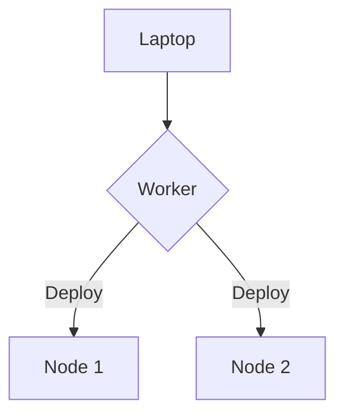
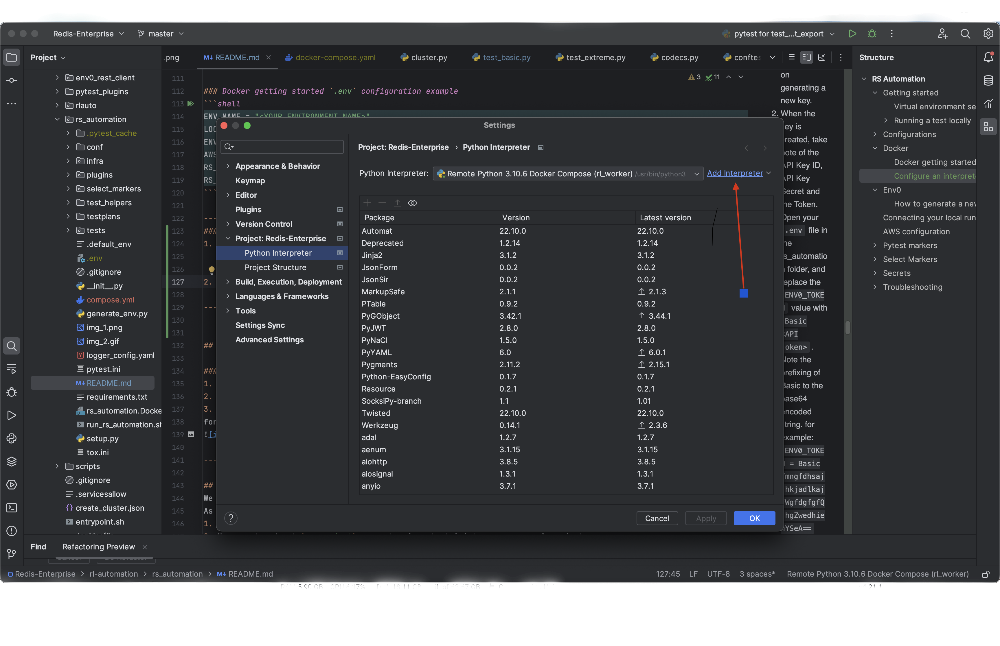
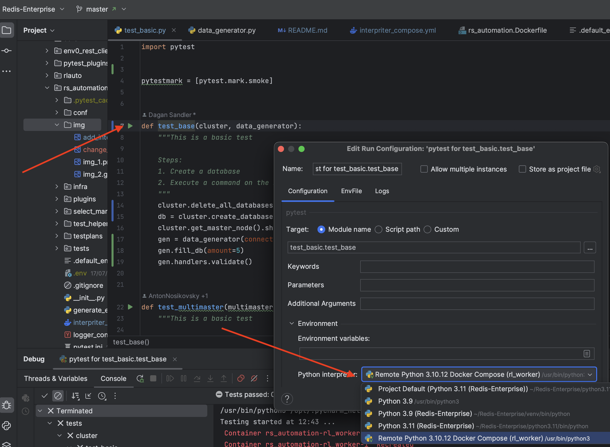
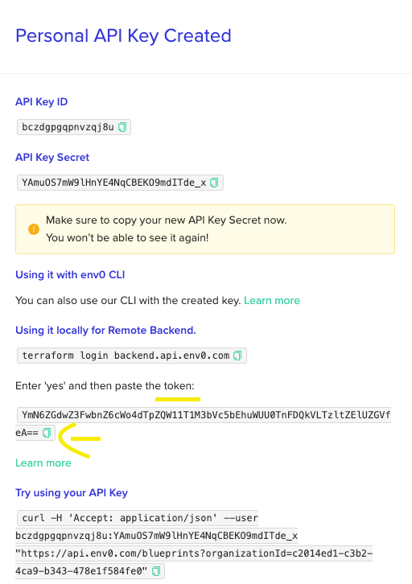

# RS Automation

This documentation refers to the post-Opereto PyTest-based automation infrastructure for RS.

The automation infrastructure relies on `pytest` as the tests' driver with the `rlauto` library as a driver for RS objects (Also known as the "OO").

----

## Getting started
#### To clone the repository and load Redis-Enterprise as a new PyCharm project, follow these steps:

- Open a terminal window.
1. **Clone the Repository**:
   - Run the following command to clone the repository:
     ```bash
     git clone <repository-url>
     ```
   - Replace `<repository-url>` with the URL of your Git repository.

2. **Open PyCharm**:
   - Launch PyCharm.

3. **Load the Project**:
   - In PyCharm, go to `File` -> `Open`.
   - Navigate to the directory where you cloned the repository.
   - Select the folder containing the `Redis-Enterprise` project and click `Open`.

4. **Set Up the Python Interpreter**:
   - Go to `File` -> `Settings` -> `Project` -> `Python Interpreter`.
   - Click the gear icon and select `Add`.
   - Choose `New Virtual Environment` or configure an existing one.
   - Change the working directory to the rl-automation/rs_automation folder.
   - Install the required dependencies using:
     ```bash
     pip install -r requirements.txt
     ```

#### This will load the project and set it up in PyCharm.
5.**Additional Options to configure IDE**:
   - [Pycharm Guide (Recommended)](https://www.jetbrains.com/help/pycharm/creating-virtual-environment.html#existing-virtual-environment), [VSCode Guide](https://code.visualstudio.com/docs/python/environments#_working-with-python-interpreters).


[Running test locally](pycharm_config.md)

## Configurations

### Options for passing in configuration parameters:
- `rs_automation/pytest.ini`
- `rs_automation/.default_env` Default Environment variables that are not likely to change (in case same variable defined in `rs_automation/.env` we will take the value defined in `rs_automation/.env` )
- `rs_automation/.env`  Environment variables, create this file and add your personal data as ENV0_TOKEN/env_name this file automatically marked as git ignore
- pytest command line options. You can see all the available options under `rs_automation/tests/conftest.py`. For example: pytest -k "test_basic" --upload_coredumps=True
- Environment variables

> It's allowed to have the same variables on both .env and .default_env - in this case, the value under .env will be taken
therefore, it's recommended remaining .default_env untouched and editing only the .env file

[Configuration options](configuration.md)


#### AWS credentials
#### Working with one aws profile ( need to replace token after each re-login)
[AWS profile login and credentials](https://redislabs.atlassian.net/wiki/spaces/RED/pages/3372122127/Non+Production+Cloud+Accounts+Access#Console-Access)

#### Set these values as environment variables in .env

| Value                 | Is Required                  | Description                                               | Default Value |
|-----------------------|------------------------------|-----------------------------------------------------------|---------------|
| AWS_ACCESS_KEY_ID     | Yes if no profile configures | Access key used to authenticate with AWS services.        |               |
| AWS_SECRET_ACCESS_KEY | Yes if no profile configures | Secret access key used to authenticate with AWS services. |               |
| AWS_SESSION_TOKEN     | Yes if no profile configures | Temporarily token.                                        |               |

#### Working with multiple AWS accounts and Profile at the same time
The step to configure aws profile [AWS profile](https://redislabs.atlassian.net/wiki/spaces/RED/pages/3372122127/Non+Production+Cloud+Accounts+Access#Working-with-multiple-AWS-accounts-and-Profile-at-the-same-time).
  - AWS_PROFILE = "<YOUR AWS PROFILE>"

#### ENV_PROVIDER descriptions
  - `env0` - Use Env0 as a provider. See below for specific environment provider configurations
  - `file` - Provide environment data through a `json` or `yaml` file.
  - `simple` -  Provide environment data through json dict
  - `ops` - to create a service cluster use ops provider.
  - `docker` - Use docker as a provider, create a cluster via docker
  - 'rcep' - Use RCEP as a provider, create a cluster via rcep cli

----

## Docker

### Docker getting started `.env` configuration example
```shell
ENV_NAME = "<YOUR ENVIRONMENT NAME>"
LOCAL_BUILD = True (optional - default is False need to build the image on laptop)
ENV_PROVIDER = "docker"
AWS_PROFILE = "<YOUR AWS PROFILE>"
RS_BUILD = "1"
RS_VERSION = "100.1.0"
```

----
### Running RS Automation tests with docker cluster
Check documentation on how to run tests with docker cluster on [this Wiki Page](https://redislabs.atlassian.net/wiki/spaces/RED/pages/3947397228/Running+RS+automation+tests+with+docker+cluster)

----
### Configure an interpreter using Docker

In order to run traffic during the test, a Docker interpreter is required.(the test runner should share the same network as the cluster nodes).
The following topology is deployed:


1. Requirements:
   1. Pycharm professional version is required (ask the IT for the license)
   2. Be sure that the root of the pycharm project is Redis-Enterprise (we are using dev-scripts for deployment)
   3. The worker is built from rs_automation.Dockerfile. So The environment may be different from local interpreter( pkg, python, etc)
   4. The local laptop should be logged into aws account (`aws sso login --profile <YOUR AWS PROFILE>`)
   5. Check if network `rs_automation` exists (cmd: `docker network ls`). If not add external docker network `docker network create rs_automation`
   6. If the test does not include any traffic, it is recommended to use the default interpreter
2. Configure Docker Desktop:
   - Settings -> Resources -> File sharing 
   - Add two directories: `~/.aws` and `~/.docker`
     - If after apply the directories disappear it means they are already included in other paths
3. Log in to dockerhub from okta.
    - Click on your username in the top right corner, then select "Account Settings"
    - Go to "Security" -> "New Access Token" -> "Read-only" Access permission -> "Generate" 
    - Add the username and token to .env file (DOCKER_USERNAME, DOCKER_PASSWORD)
4. Adding a new python interpreter in PyCharm configuration:
   - Settings -> Project -> "Project Name" -> Python Interpreter -> Add Interpreter
     
   - Choose "On docker compose"
   - Configuration file is: `rs_automation/docker/interpreter_compose.yaml`
   - Click 'Next' and be patient while the 'runner container' is being built.This process may take a few minutes.
   - New python interpreter will be chosen by default, press "Create" to finish the process.
   - Run the test:
     
   

   * The following steps were taken from pycharm docs:
     - Using a `docker-compose.yml` file: [JetBrains Guide: Configure an interpreter using Docker Compose](https://www.jetbrains.com/help/pycharm/using-docker-compose-as-a-remote-interpreter.html)
     - Using a `Dockerfile` file: [JetBrains Guide: Configure an interpreter using Docker](https://www.jetbrains.com/help/pycharm/using-docker-as-a-remote-interpreter.html)
   * In case of updated requirements, the interpreter needs to be re-configured from scratch.
     This can be done by running the reconfigure docker interpreter script located under rs_automation/docker (make sure no to run it in PyCharm terminal since PyCharm needs to be restarted).

----


## Env0

### How to generate a new Env0 personal token
1. Visit https://docs.env0.com/changelog/personal-api-keys and follow the instructions on generating a new key.
2. When the key is created, take note of the API Key ID, API Key Secret and the Token.
3. Open your `.env` file in the rs_automation folder, and replace the `ENV0_TOKEN` value with `Basic <API token>`. Note the prefixing of Basic to the base64 encoded string.
for example: `ENV0_TOKEN = Basic YmngfdhsajdhkjadlkajfWgfdgfgfQdhgZwedhiehYSeA==`


----


## OPS
### How to authenticate to an ops machine with unique SSH key
1. Generate access to the ops machine, follow those steps:
  >**Make sure you set the same value in passphrase and vault password!!!**

    https://redislabs.atlassian.net/wiki/spaces/RED/pages/1284342214/How+to+login+to+ops-machine+in+QA
   
2. Set the following environment variables in your .env:
```shell
  1. RLAUTO_SSH_PUBLIC_KEY=path to your generated public key
  2. RLAUTO_SSH_PRIVATE_KEY=path to your generated private key
  3. RLAUTO_SSH_KEY_PASSPHRASE=path to a file that contains your passphrase and vault password(which is the same password). Should be created in case it does not exist yet. 
  4. VAULT_USERNAME=the username as kept in s3 ops-vault-users
  5. ALLOWED_SSH_ADDRESS=external ip (check your external IP on whatismyip.com)
```
----
## RCEP:
1. ## RCEP CONFIGURATION

Required configurations of laptop for RCEP tests:
 - Set your laptop's external IP address in the allowed IP list of the RCP server. 
   -
[ Change the IP's at the whitelist ](https://redislabs.atlassian.net/wiki/spaces/RED/pages/1520304192/Change+the+IP+s+at+the+whitelist+of+the+old+rcp+QA+server+rcp-server-1.qa.redislabs.com+and+on+the+new+ones.#How-to-add-your-IP-address-to-the-whitelist-in-an-environment-with-ingress.%5BhardBreak%5D)

 - docker service should be installed on the machine
 - login to the docker registry with the following command:
   ```shell
   docker login -u <username> -p <password> <registry>
   ```
    - set the following environment variables in your .env:
    ```shell
    RCP_SERVER_HOSTNAME=<hostname>
    RCP_SERVER_USER=<username>
    RCP_SERVER_PASSWORD=<password>
    RCP_AWS_ACCESS_KEY_ID=<access_key>
    RCP_ALLOWED_IP=<external_ip>
    RCP_CLI_VERSION=<version>  # Optional - if not set, the version will be set to the RCP server version
    ```

2. ## RCEPAdmin Basic Usage

`RCEPAdmin` is a class that provides administrative functions for a cluster. Here's a basic usage example:

```python
from rlauto.oo.cluster_admin.rcep_admin import RCEPAdmin

# Assuming 'cluster' is an instance of your cluster
admin = RCEPAdmin(cluster)

# Add a node
admin.add_node(4, instance_type="m5.xlarge")

# Remove a node
admin.remove_node(3)

# Replace a node
admin.replace_node(2)
```

## Connecting your local run to ReportPortal
We rely on ReportPortal's pytest agent to integrate with ReportPortal.
As a minimum configuration when working locally, you should:
1. Uncomment the `--reportportal` argument in pytest.ini.
2. Uncomment and set `rp_project` parameter in pytest.ini to your personal project.
3. Set `RP_API_KEY` environment variable with your personal token (can be located on your profile page in ReportPortal).

The pytest agent for ReportPortal offers additional configuration options, you can explore them [here](https://github.com/reportportal/agent-python-pytest/).

---

## Running test or module repeatedly using pytest-repeat plugin
Pytest-repeat plugin was added to requirements.txt file, in order to run a test/module repeatedly.
You can use it from jenkins or locally.
### Run in Jenkins
1. Make sure you put your test or module under PYTEST_KEYWORDS parameter in jenkins job (custom-runner).

   In case of running parametrized test(workaround due to known pytest-repeat issue https://github.com/pytest-dev/pytest-repeat/issues/21):
   * Set PYTEST_NODES_IDS to the module only (tests/cluster/test_basic.py)
   * Set PYTEST_KEYWORDS as a partial of the test itself, omitting the closing parantheses ']'
   for example: `test_basic[sharding]` should be set as `test_basic[sharding`
2. Add the following to ENV_VARS `REPEAT_COUNT=<number of repeats>` to run the test/module repeatedly.
3. Add the following to ENV_VARS `REPEAT_SCOPE=<function/session/module/class>` to override default tests executions order, default is function.
4. Add the following to ENV_VARS `STOP_ON_FAILURE=<true/false>` to stop the run on first failure.

### Run locally
IF it is the first time you run the tests locally, please run `pip install -r requirements.txt` in order to install pytest-repeat plugin. 
Uncomment the following lines in pytest.ini file:
1. `--count` for the number of repeats.
2. `--repeat-scope` to change the scope of the repeats (optional). The default is function.
3. Uncomment `-x` argument to stop the run on first failure (optional).

##### In addition, if you want to mark a test in your code to be repeated a number of times, you can use the `@pytest.mark.repeat(count)` decorator
   
To learn more about pytest-repeat plugin, please visit [pytest-repeat](https://pypi.org/project/pytest-repeat/).

---

## Test execution order using pytest-order plugin
The pytest-order plugin has been added to control the order of test execution. This plugin allows you to explicitly specify the order in which tests should run.

### Basic usage
You can use the `@pytest.mark.order(n)` decorator to specify the order of test execution, where tests with lower order numbers run first:

```python
@pytest.mark.order("first")
def test_first():
    # This will run first
    pass

@pytest.mark.order("second")
def test_second():
    # This will run second
    pass
```
The pytestmark approach is used to apply the order marker to all tests within a module.
```python
# At the top of your test module
pytestmark = [pytest.mark.order("first")]
```
### Order values flexibility
The `@pytest.mark.order()` decorator accepts both numeric and string values:

```python
# Using numeric values
@pytest.mark.order(1)
def test_second():
    pass

# Using string values
@pytest.mark.order("first")
def test_first():
    pass
```
Available string values include:
 - "first", "second", "third", ..., "eighth" (maps to 0, 1, 2, ..., 7)
 - "last", "second_to_last", "third_to_last", ..., "eighth_to_last" (maps to -1, -2, -3, ..., -8)

For values beyond this range, you must use numeric values directly.

To learn more about available options and advanced usage, please visit [pytest-order](https://pypi.org/project/pytest-order/).

---

## AWS configuration
1. SSO Login to AWS: You can find instructions [here](https://redislabs.atlassian.net/wiki/spaces/RED/pages/3372122127/R+D+Cloud+Accounts+Access#Organizations).
> **Important!** Please leave "SSO session name" empty when setting up your AWS sso profile.
3. Add your AWS profile name as "AWS_PROFILE" in `.env` file (note: this step is not needed when logged in as the default profile)
4. If your test needs to action directly on aws please add the following flag, for example - stop_instance()
`@pytest.mark.usefixtures("aws_login")`

----

## Azure configuration
1. In order to SSO Login to Azure install azure-cli: `brew install azure-cli`
2. If your test needs to action directly on azure please add the following marker:
`@pytest.mark.usefixtures("azure_login")`

----

## Pytest markers

###  Any pytest module/test can be tagged with the following markers

#### Execution context markers which will define on which execution this flow will be triggered
- @pytest.mark.test_plan(TestPlan.REGRESSION)
- @pytest.mark.test_plan(TestPlan.CRDB_NIGHTLY)
- @pytest.mark.test_plan(TestPlan.DMC_NIGHTLY)
- @pytest.mark.test_plan(TestPlan.CLUSTER_NIGHTLY)
- @pytest.mark.test_plan(TestPlan.WEEKLY)
- @pytest.mark.test_plan(TestPlan.PERFORMANCE)


### Additional information regarding the available markers
 - @pytest.mark.invalidate_env - When used, the environment will be taken out of the env manager's available environments pool, making it unavailable for subsequent tests.
This is usually used in cases for when a certain test module modifies the cluster in a way that is either destructive or changes the underlying infrastructure.


## Select Markers
The select marker plugin provides the implementation required for using markers with argument and select the tests
that will run using these markers

### Select Markers used by rs_automation:
 - feature
 - operation

### Adding values to a Select Marker
The values for each select marker are maintained in an Enum located under `rs_automation/select_markers`</br>
Adding new values to a select marker is done by adding an instance to the relevant Enum

### Adding new `SelectMarkers`
Will be done by the automation infra team. For more information see the plugin README.md

### Marking a test with a select marker
Done using `@pytest.mark<marker name>(<one or more of the marker values>)`</br>

#### Examples:
 - `@pytest.mark.feature(feature_1)`
 - `@pytest.mark.feature(feature_1, feature_2)`

### Running a test with select marker
Done by adding `--<marker cli option>` followed by a value or an expression
containing values combined with `or` or `and`

#### Examples:
 - pytest --feature feature_1
 - pytest --feature "feature_1 or feature_2"
 - pytest --feature "feature_1 and feature_2"
 - pytest --feature "feature_1 and feature_2 or feature_3"

----

## Secrets
#### We use "**sops**" in order to store our secrets
 - Install sops util: (**version 3.7 and later**) for mac please run "brew install sops", for ubuntu please follow instructions: https://github.com/mozilla/sops
 - The Secrets are stored in S3 storage and encrypted by KMS
(https://rl-automation.s3.amazonaws.com/rs-automation-secrets/secrets.yaml)
 - Local encrypted file: rl-automation/rs_automation/tests/secrets.yaml
 - To be able to modify the secrets aws login is needed, for login - define aws credentials (access key, secret key, token) from dev@granita or dev2 - choose "Set AWS environment variables" on terminal ("export AWS_ACCESS_KEY_ID=...")
 - Decode the secrets: `sops -kms arn:aws:kms:eu-central-1:022044324644:key/546e1c35-d8ce-4432-9e7b-83564195c220 rl-automation/rs_automation/tests/secrets.yaml`
 - Modify and save (same as modifying a file using `vi` linux tool) - you should see the file update as a commit change in your IDE while the new secret value is encrypted
 - The modified file will be uploaded to S3 on "push to master" event (automatically)
 - In order to use the updated secrets file before merging it, add `USE_LOCAL_SECRETS_FILE = True` to `.env`

----

## Troubleshooting

### Log configuration
Logging configuration can be done via `pytest.ini`. You can set the log level, format, etc.

### Common issues
  - `pytest-dotenv` - in case you're using mac/linux and don't have this package you won't be able to read ".env" file and get this error: "You must provide `env_name` parameter through `.env` file  or -- cli option".
  - `pytest-xdist` - in case you're running into "worker_id" key error it means you're missing this package.
