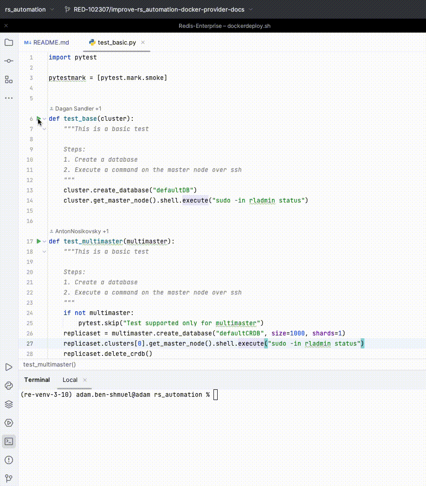

# Running a Test Locally

Executing tests can be done either via the IDE or the command line.

Before running your first test, ensure that all required configurations are properly set.

## Running Tests from the IDE (PyCharm Recommended)

To execute a test using the PyCharm UI:

1. Open the desired test in the editor.
2. Press the **Play** button next to the test method.



This method provides an intuitive interface for running and debugging individual tests.

## Running Tests from the Command Line

Alternatively, tests can be executed using `pytest` from the command line.

```bash
pytest -k "test_basic"
```

Use the `-k` option to specify and run a particular test by its name pattern.